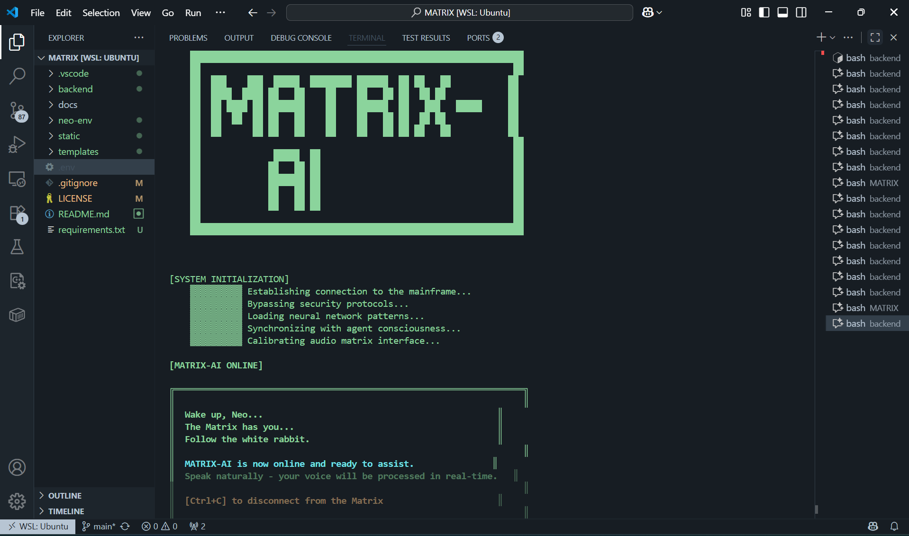

# MATRIX-AI Voice Assistant

A sophisticated voice AI assistant that brings the Matrix aesthetic to conversational AI. Built with Python and powered by ElevenLabs' cutting-edge Conversational AI API, this application delivers real-time voice processing with an immersive cyberpunk interface.



*Experience the Matrix through voice - where every conversation is a journey down the rabbit hole.*

## Overview

MATRIX-AI represents the fusion of advanced artificial intelligence with iconic cyberpunk aesthetics. This production-ready application transforms your terminal into a gateway to the Matrix, featuring seamless voice interactions powered by state-of-the-art neural networks.

The system processes natural language through sophisticated speech-to-text and text-to-speech technologies, creating an intuitive voice interface that responds with Matrix-themed personality and technical expertise.

## Features

### Core Capabilities
- **Real-time Voice Processing**: Continuous speech recognition with sub-second response times
- **Neural Voice Synthesis**: High-quality, natural-sounding AI voice responses
- **Matrix-themed Interface**: Immersive terminal experience with animated ASCII art
- **Contextual Conversations**: Maintains conversation history for coherent dialogue
- **Error Recovery**: Robust error handling with graceful degradation

### Technical Excellence
- **Modular Architecture**: Clean separation of concerns for maintainability
- **Secure Configuration**: Environment-based credential management
- **Cross-platform Audio**: Optimized for Linux/WSL2 with PulseAudio integration
- **Scalable Design**: Foundation prepared for web application integration
- **Production-ready**: Comprehensive logging and error handling

## Architecture

### System Design
**Backend Core**: Python application with Matrix-themed command-line interface (`backend/app.py`)
- Implements ElevenLabs Conversational AI integration
- Features custom ANSI color schemes and animated text rendering
- Manages WebSocket connections for real-time audio streaming
- Handles session state and conversation context

**Frontend Foundation**: Complete static asset structure for future web integration
- Matrix-themed CSS styling with cyberpunk color schemes
- JavaScript modules for interactive components and visual effects
- HTML templates ready for React/Vue.js integration
- Audio response caching and playback management

**Dependencies & Integration**: 
- **ElevenLabs SDK**: Conversational AI API for speech processing
- **PyAudio**: Cross-platform audio I/O for microphone and speaker access
- **PulseAudio**: Linux audio server integration for WSL2 compatibility
- **Python-dotenv**: Secure environment variable management

**Platform Optimization**: 
- **Primary**: Linux/WSL2 with optimized audio pipeline
- **Secondary**: Cross-platform compatibility considerations
- **Audio Stack**: ALSA → PulseAudio → PyAudio → ElevenLabs

## Installation

### Prerequisites
Before installation, ensure your system meets these requirements:
- **Python 3.7+** (Python 3.12 recommended for optimal performance)
- **Linux/WSL2** environment for best audio compatibility
- **ElevenLabs Account** with API access and sufficient credits
- **Audio Hardware**: Functional microphone and speakers/headphones
- **Network**: Stable broadband connection (minimum 1 Mbps for real-time processing)

### System Setup

**Step 1: Clone and Environment Setup**
```bash
# Clone the repository
git clone https://github.com/ak23bar/NEO.git
cd MATRIX

# Create isolated Python environment
python -m venv neo-env
source neo-env/bin/activate

# Install all dependencies
pip install -r requirements.txt
```

**Step 2: Audio Configuration (Linux/WSL2)**
```bash
# Install required audio packages
sudo apt update
sudo apt install pulseaudio pulseaudio-utils alsa-utils

# Start PulseAudio (if not running)
pulseaudio --start

# Verify audio devices
aplay -l  # List available audio devices
pactl list sources short  # Check microphone sources
```

**Step 3: ElevenLabs Configuration**
1. Create an account at [ElevenLabs](https://elevenlabs.io)
2. Generate an API key from your dashboard
3. Create a conversational AI agent
4. Note your Agent ID from the agent settings
5. Ensure your account has sufficient credits

### Environment Configuration

Create a `.env` file in the project root with your credentials:
```env
# ElevenLabs API Configuration
AGENT_ID=your_elevenlabs_agent_id_here
ELEVENLABS_API_KEY=your_api_key_here

# Optional: Development settings
DEBUG=false
LOG_LEVEL=INFO
ENV=production
```

**Security Note**: Never commit your `.env` file to version control. The repository includes `.gitignore` rules to prevent accidental exposure of credentials.

## Usage

### Starting the Application

**Activate Environment and Launch:**
```bash
# Navigate to project directory
cd MATRIX

# Activate Python virtual environment
source neo-env/bin/activate

# Launch the Matrix voice assistant
cd backend
python app.py
```

### Interface Experience

**Initialization Sequence:**
1. **Matrix Boot**: Animated ASCII art displays the iconic Matrix branding
2. **System Check**: Application verifies ElevenLabs connection and audio devices
3. **Voice Activation**: Microphone begins listening for voice input
4. **Ready State**: Interface displays "MATRIX ONLINE" with green terminal aesthetics

**Interaction Flow:**
- **Voice Input**: Speak naturally - the system continuously monitors for speech
- **Processing Visual**: Matrix-themed loading animations during AI processing
- **Voice Response**: High-quality neural voice synthesis plays through speakers
- **Conversation Display**: Real-time transcription shows both user input and AI responses
- **Context Awareness**: System maintains conversation history for coherent dialogue

**Matrix Interface Features:**
- **ASCII Art Banner**: Iconic Matrix logo with animated character rendering
- **Color Coding**: Green terminal text with Matrix-themed ANSI colors
- **Loading Animations**: Cyberpunk-style progress indicators
- **Error Handling**: Matrix-themed error messages and recovery options
- **Session Management**: Graceful startup and shutdown sequences

## Project Structure

```
MATRIX/
├── backend/                   # Core Application Backend
│   ├── app.py                 # Main Matrix-themed voice assistant
│   └── setup.py               # Package configuration and metadata
├── static/                    # Frontend Assets (Future Web Integration)
│   ├── css/
│   │   └── styles.css         # Matrix-themed styling and animations
│   └── js/
│       ├── app.js             # Main application logic
│       ├── matrix-rain.js     # Digital rain effect implementation
│       ├── simple.js          # Basic interaction handlers
│       └── test.js            # Frontend testing utilities
├── templates/                 # HTML Templates (Future Web Interface)
│   └── index.html             # Main web interface foundation
├── docs/                      # Documentation and Media
│   └── matrix_ss.png          # Interface screenshot for README
├── neo-env/                   # Python Virtual Environment
│   ├── bin/                   # Python executables and activation scripts
│   ├── lib/                   # Installed Python packages
│   └── pyvenv.cfg             # Environment configuration
├── .env                       # Environment variables (create manually)
├── .gitignore                 # Git exclusion patterns
├── requirements.txt           # Python dependencies specification
├── LICENSE                    # MIT License terms
└── README.md                  # This documentation file
```

### Key Components

**Core Application (`backend/app.py`):**
- Matrix-themed command-line interface with full ANSI color support
- ElevenLabs Conversational AI integration with WebSocket streaming
- Real-time audio processing pipeline with error recovery
- Animated text rendering and visual effects system
- Session management and conversation state handling

**Web Foundation (`static/` and `templates/`):**
- Complete CSS framework with Matrix cyberpunk styling
- JavaScript modules for interactive Matrix effects
- HTML template structure ready for framework integration
- Responsive design foundation for future web deployment

**Environment Management:**
- Isolated Python virtual environment with dependency tracking
- Secure credential storage with `.env` file configuration
- Cross-platform compatibility considerations
- Production deployment preparation

## Technical Details

### Voice Processing Pipeline

```
┌─────────────────────────────────────────────────────────────────────────────────┐
│                           MATRIX-AI Voice Processing Pipeline                    │
└─────────────────────────────────────────────────────────────────────────────────┘

    [Your Voice] 🎤
         │
         ▼
┌─────────────────┐    ┌──────────────────┐    ┌─────────────────────┐
│   Microphone    │───▶│     PyAudio      │───▶│  Audio Buffering    │
│   Hardware      │    │   Audio I/O      │    │   & Formatting      │
└─────────────────┘    └──────────────────┘    └─────────────────────┘
                                                          │
                                                          ▼
┌─────────────────────────────────────────────────────────────────────────────────┐
│                            Network Transmission                                 │
│                                                                                 │
│    ┌─────────────────┐    ┌──────────────────┐    ┌─────────────────────┐     │
│    │   WebSocket     │───▶│   ElevenLabs     │───▶│   Real-time Audio   │     │
│    │  Connection     │    │   API Gateway    │    │    Streaming        │     │
│    └─────────────────┘    └──────────────────┘    └─────────────────────┘     │
└─────────────────────────────────────────────────────────────────────────────────┘
                                                          │
                                                          ▼
┌─────────────────────────────────────────────────────────────────────────────────┐
│                         ElevenLabs AI Processing                               │
│                                                                                 │
│  ┌─────────────────┐  ┌──────────────────┐  ┌─────────────────────────────────┐ │
│  │ Speech-to-Text  │─▶│ Language Model   │─▶│    Conversational AI Agent      │ │
│  │   Recognition   │  │   Processing     │  │   (Matrix Personality +        │ │
│  │                 │  │                  │  │    Technical Expertise)        │ │
│  └─────────────────┘  └──────────────────┘  └─────────────────────────────────┘ │
│                                                          │                     │
│                                                          ▼                     │
│  ┌─────────────────────────────────────────────────────────────────────────────┐ │
│  │                    Neural Voice Synthesis                                  │ │
│  │                                                                             │ │
│  │    ┌─────────────────┐    ┌──────────────────┐    ┌─────────────────┐    │ │
│  │    │  Text Response  │───▶│  Neural Voice    │───▶│  High-Quality   │    │ │
│  │    │   Generation    │    │     Models       │    │  Audio Output   │    │ │
│  │    └─────────────────┘    └──────────────────┘    └─────────────────┘    │ │
│  └─────────────────────────────────────────────────────────────────────────────┘ │
└─────────────────────────────────────────────────────────────────────────────────┘
                                                          │
                                                          ▼
┌─────────────────────────────────────────────────────────────────────────────────┐
│                           Audio Return Path                                     │
│                                                                                 │
│    ┌─────────────────┐    ┌──────────────────┐    ┌─────────────────────┐     │
│    │  WebSocket      │◀───│   Compressed     │◀───│    Audio Stream     │     │
│    │   Response      │    │  Audio Stream    │    │    Packaging       │     │
│    └─────────────────┘    └──────────────────┘    └─────────────────────┘     │
└─────────────────────────────────────────────────────────────────────────────────┘
                                                          │
                                                          ▼
┌─────────────────┐    ┌──────────────────┐    ┌─────────────────────┐
│   Audio Buffer  │───▶│     PyAudio      │───▶│    Speakers/        │
│   Processing    │    │   Playback       │    │   Headphones        │
└─────────────────┘    └──────────────────┘    └─────────────────────┘
                                                          │
                                                          ▼
                                               [AI Voice Response] 🔊

                        ┌─────────────────────────────────────┐
                        │         Timing Metrics              │
                        │  • Total Latency: <200ms           │
                        │  • Audio Quality: 22kHz sampling   │
                        │  • Network: Compressed streaming   │
                        │  • Processing: Real-time neural    │
                        └─────────────────────────────────────┘
```

### Component Breakdown

**Audio Capture and Processing:**
1. **Microphone Input**: PyAudio continuously monitors default audio input device
2. **Signal Processing**: Audio data is buffered and formatted for transmission
3. **WebSocket Streaming**: Real-time audio packets sent to ElevenLabs API
4. **Speech Recognition**: ElevenLabs converts speech to text with high accuracy
5. **Language Processing**: AI agent processes natural language and generates contextual responses
6. **Neural Voice Synthesis**: Response text converted to natural-sounding speech
7. **Audio Playback**: Generated audio streams back through system speakers

**ElevenLabs Integration Details:**
- **Conversational AI API**: Advanced language model with voice synthesis
- **WebSocket Protocol**: Low-latency bidirectional communication
- **Neural Voice Models**: High-quality, natural-sounding voice generation
- **Context Management**: Maintains conversation state across interactions
- **Audio Quality**: 22kHz sampling rate with configurable compression

### Matrix Interface Implementation

**Visual System Architecture:**
- **ANSI Color Management**: Custom color classes for Matrix green aesthetics
- **Character Animation**: Letter-by-letter text rendering with timing control
- **ASCII Art System**: Multi-line banner rendering with animation sequences
- **Loading Indicators**: Progress bars and spinners with Matrix styling
- **Error Visualization**: Themed error messages with recovery guidance

**Terminal Enhancements:**
- **Cross-platform Compatibility**: Windows/Linux terminal support
- **Color Depth Detection**: Automatic fallback for limited color terminals
- **Screen Management**: Dynamic content sizing and scroll handling
- **Input/Output Separation**: Clean distinction between user and system text

### Performance and Optimization

**Real-time Processing:**
- **Audio Latency**: Sub-200ms response times for optimal conversation flow
- **Memory Management**: Efficient buffer handling for continuous operation
- **Network Optimization**: Compressed audio transmission with quality preservation
- **Error Recovery**: Automatic reconnection and graceful degradation

**Scalability Considerations:**
- **Modular Architecture**: Clean separation of concerns for easy extension
- **Configuration Management**: Environment-based settings for different deployments
- **Logging System**: Comprehensive activity tracking for debugging and monitoring
- **Resource Management**: Optimized CPU and memory usage patterns

## System Requirements

### Minimum Requirements
- **CPU**: Dual-core processor (2.0 GHz or higher)
- **RAM**: 4GB available system memory
- **Storage**: 2GB free disk space (including dependencies)
- **Network**: Stable internet connection (minimum 1 Mbps upload/download)
- **Audio**: Functional microphone and speakers/headphones
- **OS**: Ubuntu 18.04+, WSL2 with Ubuntu, or compatible Linux distribution

### Recommended Specifications
- **CPU**: Quad-core processor (3.0 GHz) for optimal performance
- **RAM**: 8GB+ for smooth multitasking during voice processing
- **Network**: Broadband connection (5+ Mbps) for best response times
- **Audio**: High-quality USB microphone and headphones for clear communication
- **Terminal**: Modern terminal emulator with full ANSI color support

### Development Environment
- **Python**: 3.12+ (latest stable version recommended)
- **IDE**: VS Code with Python extensions for optimal development experience
- **Git**: Version control for project management and contributions
- **Audio Tools**: `pulseaudio`, `alsa-utils` for Linux audio stack

## Troubleshooting

### Common Issues and Solutions

**Audio Configuration Problems:**
```bash
# Check if PulseAudio is running
pulseaudio --check -v

# Restart PulseAudio if needed
pulseaudio --kill && pulseaudio --start

# Verify microphone detection
arecord -l

# Test microphone input
arecord -f cd test.wav  # Record test audio
aplay test.wav         # Play back recording
```

**ElevenLabs API Issues:**
- **401 Authentication Error**: Verify API key format and validity in `.env` file
- **403 Forbidden**: Check account credits and billing status
- **Agent Not Found**: Confirm Agent ID matches your ElevenLabs dashboard
- **Network Timeouts**: Ensure stable internet connection and firewall settings

**Python Environment Problems:**
```bash
# Verify virtual environment activation
which python  # Should show path to neo-env/bin/python

# Reinstall dependencies if needed
pip install --force-reinstall -r requirements.txt

# Check Python version compatibility
python --version  # Should be 3.7 or higher
```

**WSL2 Specific Issues:**
- **Audio Not Working**: Ensure WSLg is installed and running
- **Microphone Access**: Check Windows privacy settings for microphone access
- **Performance Issues**: Allocate more memory to WSL2 in `.wslconfig`

## Contributing

### Development Workflow
1. **Fork Repository**: Create your own fork on GitHub
2. **Create Branch**: `git checkout -b feature/your-feature-name`
3. **Development**: Make changes following existing code patterns
4. **Testing**: Verify functionality with test utilities
5. **Documentation**: Update README and code comments as needed
6. **Pull Request**: Submit PR with clear description of changes

### Code Standards
- **Python Style**: Follow PEP 8 guidelines for code formatting
- **Error Handling**: Implement comprehensive exception management
- **Documentation**: Include docstrings for all functions and classes
- **Security**: Never commit credentials or sensitive data
- **Testing**: Include test cases for new functionality

### Areas for Contribution
- **Web Interface**: Complete the frontend web application
- **Voice Customization**: Add voice selection and personality options
- **Database Integration**: Implement conversation history storage
- **Mobile Support**: Develop mobile app version
- **Additional AI Models**: Integration with other AI providers

## License

This project is released under the MIT License, which allows for:
- **Commercial Use**: Use in commercial projects and products
- **Modification**: Modify the source code for your needs
- **Distribution**: Share and distribute the software
- **Private Use**: Use privately without restrictions

See the [LICENSE](LICENSE) file for complete terms and conditions.

## Author & Acknowledgments

**Developed by Akbar (Neo)**
- Computer Engineering student specializing in AI/ML implementation
- Full-stack developer with expertise in Python, React, and cloud technologies
- Focus on production-ready software architecture and deployment

**Special Thanks:**
- **ElevenLabs**: Advanced conversational AI technology and neural voice synthesis
- **Matrix Universe**: Inspiration for the cyberpunk aesthetic and philosophical themes
- **Alexandre Sajus**: Inspiration and guidance
- **Open Source Community**: Python ecosystem, PyAudio, and supporting libraries

**Connect:**
- **GitHub**: [ak23bar](https://github.com/ak23bar)
- **Repository**: [MATRIX-AI Project](https://github.com/ak23bar/NEO)
- **ElevenLabs**: [Get API Access](https://elevenlabs.io)

---

*"Welcome to the Matrix. Your journey into the world of AI-powered voice interaction begins now."*

